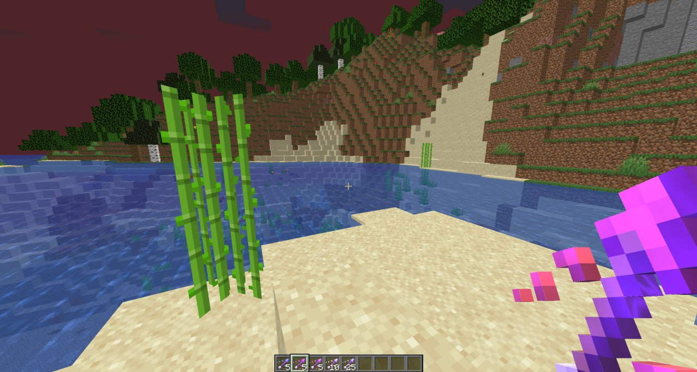
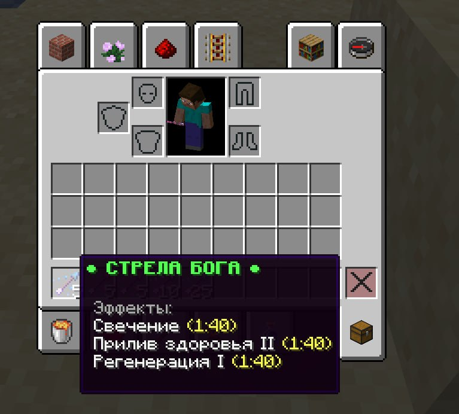
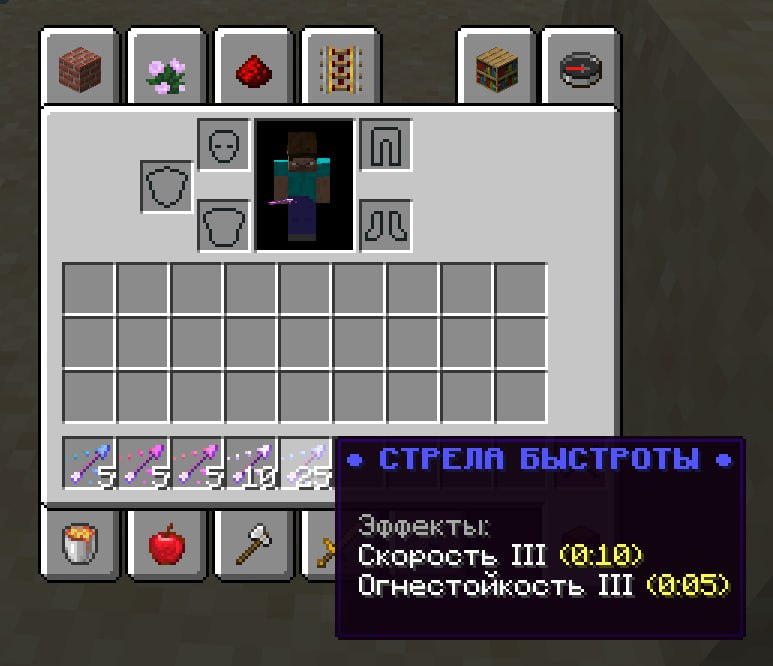
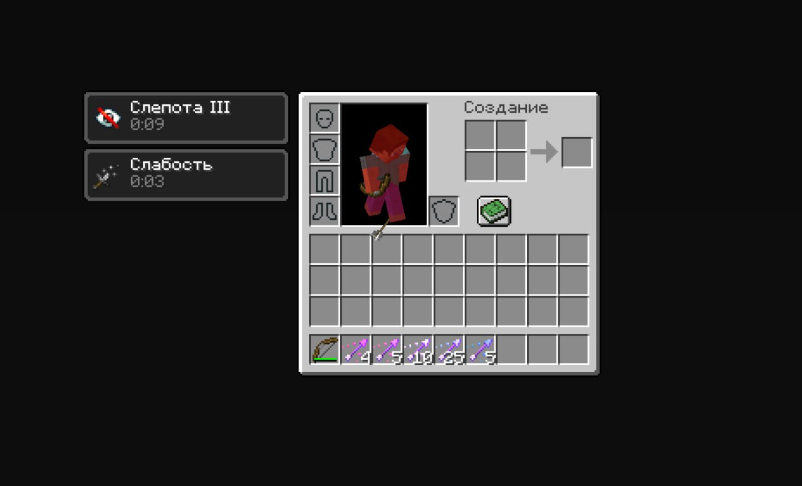
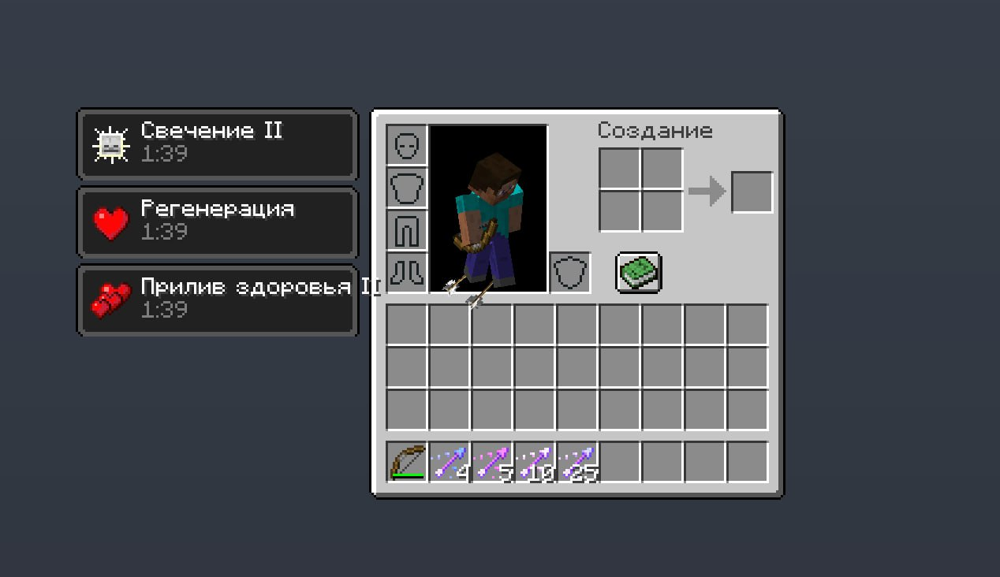

# ArrowsZZ

**ArrowsZZ** — это плагин для Minecraft, который добавляет уникальные стрелы с различными эффектами, чтобы улучшить игровой процесс. Используйте этот плагин, чтобы выдавать игрокам специальные стрелы, которые предоставляют увлекательные эффекты, добавляя новые динамики в игру!

## Возможности

-   **Уникальные стрелы**: Каждая стрела имеет специальные эффекты, которые могут улучшить или усложнить игру.
-   **Командный интерфейс**: Легкое управление распределением стрел с помощью команды `/zarrows`.
-   **Настраиваемость**: Простые параметры конфигурации для настройки сообщений, эффектов стрел и многое другое.

## Установка

1. Скачайте последнюю версию плагина ArrowsZZ.
2. Поместите файл `.jar` в папку `plugins` вашего сервера Minecraft.
3. Перезапустите сервер для загрузки плагина.

## Команды

| Команда                                   | Описание                                   |
| ----------------------------------------- | ------------------------------------------ |
| `/zarrows give <игрок> <стрела> [кол-во]` | Выдает указанному игроку выбранную стрелу. |

## Права доступа

-   `zarrows.give`: Позволяет игрокам использовать команду `/zarrows give` для распределения стрел.

## Примеры использования

1. Чтобы дать стрелу Левитации игроку:

    ```
    /zarrows give ник levetation 5
    ```

2. Чтобы дать стрелу Бога игроку:
    ```
    /zarrows give ник bog 3
    ```

## Конфигурация

Плагин использует файл конфигурации, где вы можете настраивать сообщения, доступные стрелы и их эффекты. Вот пример фрагмента конфигурации:

```yaml
messages:
    arrow_given: '&6&l(CТРЕЛЫ) &fВам была выдана &6стрела..'
    player_not_found: '&6&l(CТРЕЛЫ) &fИгрок не &aнайден!'
    arrow_not_found: '&6&l(CТРЕЛЫ) &fСтрела не найдена в &aконфиге!'
    usage: '&6&l(CТРЕЛЫ) &fИспользование: &6/zarrows give <ник> <стрела> <кол-во>'
    arrow_given_own: '&6&l(CТРЕЛЫ) &fВы выдали стрелу &6игроку'
```

## Типы стрел

Вот некоторые из уникальных стрел, которые вы можете создать с помощью этого плагина:

-   **Стрела Левитации**
    -   **Отображаемое имя**: §f§l● СТРЕЛА ПОЛЕТА ●
    -   **Эффекты**: Левитация III (0:08)
-   **Стрела Бога**

    -   **Отображаемое имя**: §a§l● СТРЕЛА БОГА ●
    -   **Эффекты**: Свечение, Прилив здоровья II, Регенерация I (1:40)

-   **Стрела Яда**

    -   **Отображаемое имя**: §7§l● СТРЕЛА ЯДА ●
    -   **Эффекты**: Отравление II, Утомление II, Замедление II (0:10)

-   **Стрела Топера**

    -   **Отображаемое имя**: §e§l● СТРЕЛА ТОПЕРА ●
    -   **Эффекты**: Сила II, Скорость II (0:10)

-   **Стрела Дезориентации**

    -   **Отображаемое имя**: §c§l● СТРЕЛА ДЕЗОРЕНТАЦИИ ●
    -   **Эффекты**: Слепота III, Слабость I (0:04)

-   **Стрела Хила**

    -   **Отображаемое имя**: §4§l● СТРЕЛА ХИЛА ●
    -   **Эффекты**: Утомление II, Исцеление II

-   **Стрела Быстроты**

    -   **Отображаемое имя**: §9§l● СТРЕЛА БЫСТРОТЫ ●
    -   **Эффекты**: Скорость III, Огнестойкость III (0:05)

-   **Стрела Кролика**
    -   **Отображаемое имя**: §d§l● СТРЕЛА КРОЛИКА ●
    -   **Эффекты**: Прыгучесть IV, Исцеление III (0:05)

## Скриншоты

  
  
  
_Стилизицая стрел_

  
  
_Уникальные эффекты стрел_

## Вклад

Если вы хотите внести свой вклад в проект, не стесняйтесь форкать репозиторий и отправлять Pull Request с вашими изменениями!

## Контакты

По вопросам или для получения поддержки обращайтесь к разработчику: [Telegram](https://t.me/zzrtk)
